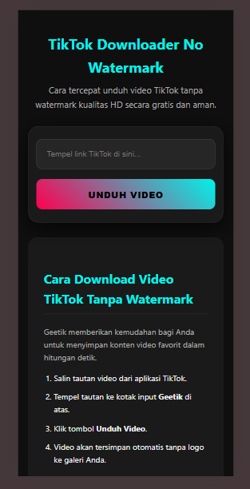

# TikTok Multi-Engine Downloader API

API ekstraksi media berperforma tinggi yang dibangun di atas bahasa pemrograman Python 3.10+ dengan framework FastAPI. Proyek ini menyediakan solusi pengunduhan video TikTok tanpa watermark dengan mengutamakan stabilitas sistem dan efisiensi penggunaan sumber daya server.



## Analisis Arsitektur dan Keunggulan Teknis

### 1. Sistem Multi-Engine (High Availability)
Implementasi arsitektur fallback otomatis untuk menjamin ketersediaan layanan. Sistem secara otomatis mendeteksi kegagalan pada mesin utama dan melakukan pengalihan rute ke mesin cadangan secara real-time.

### 2. Manajemen Memori dengan Streaming Response
Menggunakan metode Chunked Transfer Encoding. Video tidak disimpan di dalam RAM maupun penyimpanan fisik server, melainkan dialirkan langsung dalam potongan data kecil dari sumber ke pengguna.

### 3. Keamanan Internal dan Anti-Hotlinking
Sistem dilengkapi dengan filter verifikasi Referer yang terintegrasi pada endpoint API untuk memastikan konsumsi sumber daya hanya dilakukan oleh domain yang diizinkan.

### 4. Mekanisme Bypass Anti-Bot
Integrasi rotasi User-Agent dinamis dan eksekusi skrip melalui PyExecJS untuk mensimulasikan perilaku peramban asli dan meminimalisir risiko pemblokiran IP.

## Panduan Pengoperasian

### Instalasi Dependensi
```bash
pip install -r requirements.txt

### Eksekusi Server
```bash
uvicorn app:app --reload